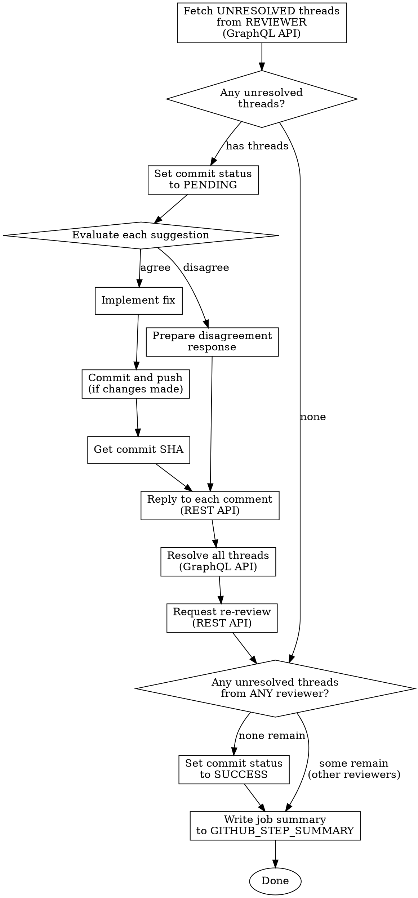

# Responding to PR Reviews

## Overview

Single-pass review response: fetch unresolved threads from a specific reviewer, evaluate each suggestion, implement valid fixes or explain disagreement, reply, resolve threads, re-request review, and update commit status.

When running in CI, the review loop is handled by workflow triggers -- each invocation handles one round. When running locally, you can invoke this skill repeatedly or handle multiple rounds manually.

## Context Variables

When invoked from CI, these are provided in the prompt:
- **Repository**: `OWNER/REPO`
- **PR number**: integer
- **Reviewer**: GitHub login of the reviewer who submitted
- **HEAD SHA**: current HEAD of the PR branch
- **Review state**: `approved`, `changes_requested`, or `commented`

## Workflow



## Quick Reference

| Step | Command |
|------|---------|
| Fetch unresolved threads | `gh api graphql` with `reviewThreads` query filtered by `isResolved: false` and reviewer login |
| Reply to comment | `gh api repos/OWNER/REPO/pulls/NUM/comments/ID/replies -f body="..."` |
| Resolve thread | `gh api graphql` with `resolveReviewThread` mutation |
| Request re-review | `gh api repos/OWNER/REPO/pulls/NUM/requested_reviewers -X POST -f "reviewers[]=REVIEWER"` |
| Set commit status | `gh api repos/OWNER/REPO/statuses/SHA -f state=STATE -f context=review-response -f description="..."` |
| Write job summary | `cat >> "$GITHUB_STEP_SUMMARY"` (or echo/printf) |

## Implementation

### 1. Fetch Unresolved Review Comments

**Login normalization:** The reviewer login passed to you (e.g. from `github.event.review.user.login`) may include a `[bot]` suffix (e.g. `copilot-pull-request-reviewer[bot]`). GitHub's GraphQL API drops the `[bot]` suffix in `author.login`, so strip it before filtering:
- GraphQL login: strip `[bot]` suffix → `copilot-pull-request-reviewer`
- REST re-review login: use the original login with `[bot]` suffix

**When reviewer is `all`:** Fetch all unresolved threads regardless of author — omit the `select(.comments.nodes[0].author.login == ...)` filter.

Use GraphQL to get only unresolved threads from the triggering reviewer. Paginate using `pageInfo` to ensure all threads are fetched:

```bash
# First page
gh api graphql -f query='
query {
  repository(owner: "OWNER", name: "REPO") {
    pullRequest(number: PR_NUMBER) {
      reviewThreads(first: 100) {
        pageInfo { hasNextPage endCursor }
        nodes {
          id
          isResolved
          path
          line
          comments(first: 10) {
            nodes {
              id
              databaseId
              body
              author {
                login
              }
            }
          }
        }
      }
    }
  }
}' --jq '.data.repository.pullRequest.reviewThreads.nodes[]
  | select(.isResolved == false)
  | select(.comments.nodes[0].author.login == "REVIEWER_GRAPHQL_LOGIN")'

# If pageInfo.hasNextPage is true, repeat with after: "END_CURSOR" until exhausted
```

If the result is empty, this is a clean review -- skip to step 8 (status check).

### 2. Set Commit Status to Pending

When unresolved threads are found, mark the status as pending:

```bash
gh api repos/OWNER/REPO/statuses/HEAD_SHA \
  -f state=pending \
  -f context=review-response \
  -f description="Addressing review feedback from REVIEWER"
```

### 3. Evaluate Each Suggestion

For each comment, consider:
- Is the suggestion technically correct?
- Does it improve the code meaningfully?
- Are there trade-offs that make the current approach better?

**If you agree:** Implement the fix.

**If you disagree:** Prepare a clear explanation of why the current approach is preferred. Valid reasons include:
- The suggestion introduces other issues
- The current code is intentionally structured this way
- The trade-off isn't worth it for this use case

### 4. Implement Fixes (if applicable)

Address agreed-upon comments by editing the relevant source files.

### 5. Commit and Push (if changes made)

```bash
git add <specific files>
git commit -m "Address review feedback from REVIEWER

<concise description of changes>"
git push
git rev-parse HEAD  # Get full SHA for linking in replies
```

### 6. Reply to Comments and Resolve Threads

**For implemented fixes:**
```bash
gh api repos/OWNER/REPO/pulls/PR_NUMBER/comments/COMMENT_ID/replies \
  -f body="Fixed in COMMIT_SHA. <description of fix>"
```

**For disagreements:**
```bash
gh api repos/OWNER/REPO/pulls/PR_NUMBER/comments/COMMENT_ID/replies \
  -f body="I considered this but prefer the current approach because <reason>."
```

**Then resolve each thread** using thread IDs from step 1:
```bash
gh api graphql -f query='
mutation {
  t1: resolveReviewThread(input: {threadId: "THREAD_ID_1"}) {
    thread { isResolved }
  }
  t2: resolveReviewThread(input: {threadId: "THREAD_ID_2"}) {
    thread { isResolved }
  }
}'
```

**Important:** Reply before resolving so context is preserved in the thread.

### 7. Request Re-review

After all threads are resolved, request a fresh review **only if a specific reviewer login was provided** (not `all`):

```bash
gh api repos/OWNER/REPO/pulls/PR_NUMBER/requested_reviewers \
  -X POST -f "reviewers[]=REVIEWER_REST_LOGIN"
```

**Note:** Use the original login (with `[bot]` suffix if present) for REST re-review requests — e.g. `copilot-pull-request-reviewer[bot]`. When reviewer is `all`, skip re-review (no single reviewer to target).

### 8. Check All Reviewers and Set Commit Status

Check for unresolved threads from ANY reviewer (not just the triggering one). Paginate to ensure an accurate count:

```bash
# Repeat with after: "END_CURSOR" if hasNextPage is true, accumulating the total
gh api graphql -f query='
query {
  repository(owner: "OWNER", name: "REPO") {
    pullRequest(number: PR_NUMBER) {
      reviewThreads(first: 100) {
        pageInfo { hasNextPage endCursor }
        nodes {
          isResolved
        }
      }
    }
  }
}' --jq '[.data.repository.pullRequest.reviewThreads.nodes[] | select(.isResolved == false)] | length'
```

If count is 0, set status to success:
```bash
gh api repos/OWNER/REPO/statuses/NEW_HEAD_SHA \
  -f state=success \
  -f context=review-response \
  -f description="All review feedback addressed"
```

If count > 0, explicitly set status to pending (other reviewers still have unresolved threads):
```bash
gh api repos/OWNER/REPO/statuses/NEW_HEAD_SHA \
  -f state=pending \
  -f context=review-response \
  -f description="Unresolved review threads remain"
```

### 9. Write Job Summary

Write a summary table to `$GITHUB_STEP_SUMMARY` documenting what was done:

```bash
cat >> "$GITHUB_STEP_SUMMARY" << 'EOF'
## Review Response -- REVIEWER

| File | Comment | Action |
|------|---------|--------|
| `path/to/file.go:42` | Description of suggestion | Fixed in `abc1234` |
| `path/to/file.go:87` | Description of suggestion | Declined -- reason |

**Status:** N fixed, M declined. Re-review requested from REVIEWER.
EOF
```

If this was a clean review (no unresolved threads in step 1), write instead:

```bash
echo "## Review Response -- REVIEWER" >> "$GITHUB_STEP_SUMMARY"
echo "" >> "$GITHUB_STEP_SUMMARY"
echo "Clean review -- no unresolved comments. Status: **success**" >> "$GITHUB_STEP_SUMMARY"
```

## Common Mistakes

| Mistake | Fix |
|---------|-----|
| Reviewing/replying to resolved threads | Only fetch unresolved threads -- resolved ones are already handled |
| Processing all reviewers when asked for specific one | Filter by `author.login` in the GraphQL query |
| Blindly implementing all suggestions | Evaluate each comment -- it's fine to disagree with valid reasoning |
| Using REST API to resolve threads | Must use GraphQL `resolveReviewThread` mutation |
| Forgetting commit SHA in reply | Always include SHA for traceability when fixing |
| Resolving before replying | Reply first so context is preserved |
| Not pushing before responding | Push so SHA exists on remote before referencing it |
| Vague disagreement responses | Explain specifically why the current approach is preferred |
| Using `git add -A` | Be precise -- `git add <specific files>` only |
| Setting status on old SHA after pushing | Use the NEW HEAD SHA from `git rev-parse HEAD` after push |
