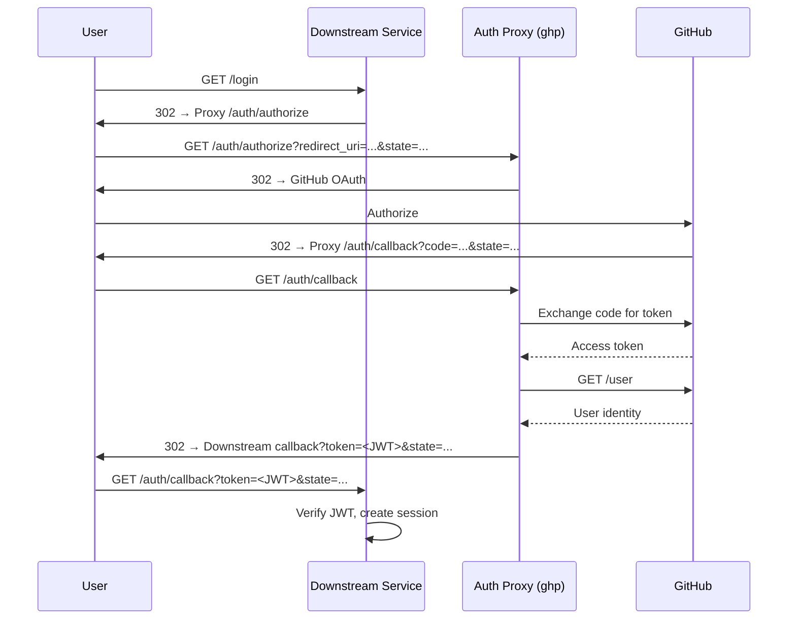

# OAuth Broker

The auth proxy can act as an **OAuth broker**, becoming the only component that
communicates with GitHub for authentication. Downstream services redirect users
to the proxy and trust the signed JWT responses they receive back.

This decouples downstream services from GitHub OAuth credentials entirely —
they never need a `client_id` or `client_secret`.

## How It Works



## Proxy Configuration

To enable the OAuth broker, add the following to your `ghp` configuration:

```yaml
auth:
  jwt_private_key_file: "/etc/ghp/broker-signing.pem"
  allowed_redirects:
    - "https://app.example.com/auth/callback"
    - "*.internal.example.com"
```

| Field | Description |
|-------|-------------|
| `auth.jwt_private_key` | PEM-encoded RSA private key used to sign broker JWTs with RS256 (asymmetric). Downstream services verify tokens using the public key from `/.well-known/jwks.json` without being able to forge them. |
| `auth.jwt_private_key_file` | Path to a PEM-encoded RSA private key file. Used when `jwt_private_key` is not set directly. |
| `auth.allowed_redirects` | List of permitted `redirect_uri` values. Supports exact URLs and wildcard domain patterns (e.g. `*.example.com` or `*.example.com/auth/callback`). See [Security Considerations](#security-considerations) for guidance on choosing patterns. |

Environment variables: `GHP_AUTH_JWT_PRIVATE_KEY` (PEM contents), `GHP_AUTH_JWT_PRIVATE_KEY_FILE` (file path)

!!! tip "Generate an RSA key pair"
    Generate a 2048-bit RSA key for JWT signing:

        openssl genrsa -out broker-signing.pem 2048

    The corresponding public key is available to downstream services at
    `{base_url}/.well-known/jwks.json` — no out-of-band key distribution required.

### GitHub App Setup

Register `{base_url}/auth/callback` as an additional **authorized callback URL**
in your GitHub App settings. This is required because the broker flow uses a
separate callback path from the management UI's `/auth/github/callback`.

---

## Integration Guide for Downstream Services

Downstream services do not need GitHub OAuth credentials. They delegate
authentication to the proxy and receive a signed JWT in return.

### Prerequisites

The downstream service needs the proxy's base URL and its public key (available
at `{auth_proxy_url}/.well-known/jwks.json`). No secret key distribution is required.

| Value | Description | Example |
|-------|-------------|---------|
| `auth_proxy_url` | Base URL of the auth proxy | `https://auth-proxy.example.com` |
| `auth_jwks_url` | JWKS endpoint for RS256 token verification | `https://auth-proxy.example.com/.well-known/jwks.json` |

### Starting the Login Flow

To initiate authentication, redirect the user to the proxy's authorize endpoint:

```
{auth_proxy_url}/auth/authorize?redirect_uri={callback_url}&state={csrf_token}
```

| Parameter | Description |
|-----------|-------------|
| `callback_url` | The downstream service's own callback endpoint. Must be registered on the proxy's `allowed_redirects` list. |
| `csrf_token` | An opaque value the downstream service generates and stores locally (e.g. in a session or cookie) for CSRF verification. |

**Example (Python / Flask):**

```python
import secrets
from urllib.parse import urlencode
from flask import redirect, session

@app.route("/login")
def login():
    state = secrets.token_urlsafe(32)
    session["oauth_state"] = state
    callback = "https://myapp.example.com/auth/callback"
    params = urlencode({"redirect_uri": callback, "state": state})
    return redirect(f"{AUTH_PROXY_URL}/auth/authorize?{params}")
```

### Handling the Callback

After the user authenticates with GitHub, the proxy redirects them back to
`callback_url` with two query parameters:

```
{callback_url}?token={jwt}&state={state}
```

The downstream service should:

1. **Verify `state`** matches the value stored at the start of the flow.
2. **Validate the JWT signature** using the proxy's public key (fetch from `/.well-known/jwks.json`).
3. **Check that `exp`** has not passed.
4. **Check that `aud`** matches the service's own callback URL.
5. **Create a local session** using the claims from the token.

**Example (Python / Flask):**

```python
import jwt  # PyJWT
import requests

# Fetch the public key once at startup (or cache with TTL).
jwks = requests.get(f"{AUTH_PROXY_URL}/.well-known/jwks.json").json()
PUBLIC_KEY = jwt.algorithms.RSAAlgorithm.from_jwk(jwks["keys"][0])

@app.route("/auth/callback")
def auth_callback():
    # 1. Verify CSRF state
    if request.args.get("state") != session.pop("oauth_state", None):
        abort(403, "Invalid state")

    # 2-4. Validate JWT
    token = request.args["token"]
    try:
        claims = jwt.decode(
            token,
            PUBLIC_KEY,
            algorithms=["RS256"],
            audience="https://myapp.example.com/auth/callback",
        )
    except jwt.InvalidTokenError as e:
        abort(401, f"Invalid token: {e}")

    # 5. Create local session
    session["user"] = claims["sub"]
    session["avatar_url"] = claims["avatar_url"]
    return redirect("/dashboard")
```

**Example (Go):**

```go
import (
    "crypto/rsa"
    "encoding/base64"
    "encoding/json"
    "fmt"
    "math/big"
    "net/http"

    "github.com/golang-jwt/jwt/v5"
)

type BrokerClaims struct {
    AvatarURL string `json:"avatar_url"`
    jwt.RegisteredClaims
}

// fetchRSAPublicKey retrieves the first RSA key from a JWKS endpoint.
func fetchRSAPublicKey(jwksURL string) (*rsa.PublicKey, error) {
    resp, err := http.Get(jwksURL)
    if err != nil {
        return nil, err
    }
    defer resp.Body.Close()
    var jwks struct {
        Keys []struct {
            N string `json:"n"`
            E string `json:"e"`
        } `json:"keys"`
    }
    if err := json.NewDecoder(resp.Body).Decode(&jwks); err != nil || len(jwks.Keys) == 0 {
        return nil, fmt.Errorf("invalid JWKS response")
    }
    nBytes, _ := base64.RawURLEncoding.DecodeString(jwks.Keys[0].N)
    eBytes, _ := base64.RawURLEncoding.DecodeString(jwks.Keys[0].E)
    e := int(new(big.Int).SetBytes(eBytes).Int64())
    return &rsa.PublicKey{N: new(big.Int).SetBytes(nBytes), E: e}, nil
}

func handleAuthCallback(w http.ResponseWriter, r *http.Request) {
    // 1. Verify CSRF state
    if r.URL.Query().Get("state") != getStoredState(r) {
        http.Error(w, "Invalid state", http.StatusForbidden)
        return
    }

    // 2-4. Validate JWT using the proxy's public key
    // publicKey is an *rsa.PublicKey fetched once at startup via fetchRSAPublicKey.
    tokenStr := r.URL.Query().Get("token")
    token, err := jwt.ParseWithClaims(tokenStr, &BrokerClaims{},
        func(t *jwt.Token) (interface{}, error) {
            if _, ok := t.Method.(*jwt.SigningMethodRSA); !ok {
                return nil, fmt.Errorf("unexpected signing method")
            }
            return publicKey, nil
        },
        jwt.WithAudience("https://myapp.example.com/auth/callback"),
    )
    if err != nil {
        http.Error(w, "Invalid token", http.StatusUnauthorized)
        return
    }

    claims := token.Claims.(*BrokerClaims)

    // 5. Create local session
    createSession(w, r, claims.Subject, claims.AvatarURL)
    http.Redirect(w, r, "/dashboard", http.StatusSeeOther)
}
```

**Example (Node.js / Express):**

```javascript
const jwt = require("jsonwebtoken");
const jwksClient = require("jwks-rsa");

const client = jwksClient({ jwksUri: `${AUTH_PROXY_URL}/.well-known/jwks.json` });

app.get("/auth/callback", async (req, res) => {
  // 1. Verify CSRF state
  if (req.query.state !== req.session.oauthState) {
    return res.status(403).send("Invalid state");
  }
  delete req.session.oauthState;

  // 2-4. Validate JWT using the proxy's public key
  try {
    const key = await client.getSigningKey();
    const claims = jwt.verify(req.query.token, key.getPublicKey(), {
      algorithms: ["RS256"],
      audience: "https://myapp.example.com/auth/callback",
    });

    // 5. Create local session
    req.session.user = claims.sub;
    req.session.avatarUrl = claims.avatar_url;
    res.redirect("/dashboard");
  } catch (err) {
    res.status(401).send("Invalid token");
  }
});
```

### JWT Claims

| Claim | Description |
|-------|-------------|
| `iss` | Issuer — the proxy's `base_url` (or `"ghp"` if not configured) |
| `sub` | GitHub username (e.g. `octocat`) |
| `avatar_url` | GitHub avatar URL |
| `aud` | The `redirect_uri` this token was issued for |
| `iat` | Issued-at timestamp (Unix epoch) |
| `exp` | Expiry timestamp — 60 seconds after `iat` |

The JWT header includes a `kid` (Key ID) field that matches the `kid` in the JWKS
endpoint, enabling downstream services to select the correct key for verification.

The token is **single-use and short-lived**. It exists only to bootstrap a local
session — downstream services should not store or reuse it beyond that.

No direct GitHub API calls are required on the downstream side.

---

## Trust Model

- The proxy holds the **RSA private key** and signs JWTs.
- Downstream services verify tokens using the **RSA public key** from `/.well-known/jwks.json` — they cannot forge tokens.
- The JWT is **single-use and short-lived** (60 seconds) — it exists only to
  bootstrap the local session.

## Security Considerations

| Concern | Mitigation |
|---------|------------|
| Open redirect | `redirect_uri` must be validated against the `allowed_redirects` allowlist on the proxy side. This is the most critical control. |
| Token replay | The `aud` claim is set to the `redirect_uri`, so a JWT minted for one service cannot be replayed against another. |
| Token expiry | `exp` is set to 60 seconds. The JWT is consumed immediately on redirect and does not need to live longer. |
| CSRF | The `state` parameter round-trips through the entire flow, allowing the downstream service to verify it. |
| HTTP downgrade | The proxy rejects `redirect_uri` values that do not use HTTPS (except `localhost` in dev mode). |
| Token forgery | RS256 (asymmetric) signing ensures downstream services can verify tokens using the public key without being able to forge them. |
| Wildcard subdomain trust | Wildcard patterns like `*.example.com` trust **all** subdomains, including ones that could be taken over via subdomain hijacking or shared hosting. Prefer path-scoped wildcards (e.g. `*.example.com/auth/callback`) to limit exposure, or use exact URL matches for production deployments. |

## Proxy Endpoints

### `GET /auth/authorize`

Entry point for the OAuth flow. Downstream services redirect users here.

| Parameter | Description |
|-----------|-------------|
| `redirect_uri` | Where to send the user after auth. Must be on the allowlist. |
| `state` | Opaque value from the downstream service for CSRF protection. |

### `GET /auth/callback`

GitHub redirects here after the user authorizes. The proxy exchanges the code,
fetches the user's identity, mints a JWT, and redirects to the downstream
service's `redirect_uri` with `token` and `state` query parameters.

### `GET /.well-known/jwks.json`

Returns the RSA public key as a [JSON Web Key Set (JWKS)](https://datatracker.ietf.org/doc/html/rfc7517),
allowing downstream services to verify RS256-signed broker JWTs. Only available
when the broker is configured with an RSA key (`jwt_private_key` /
`jwt_private_key_file`).
