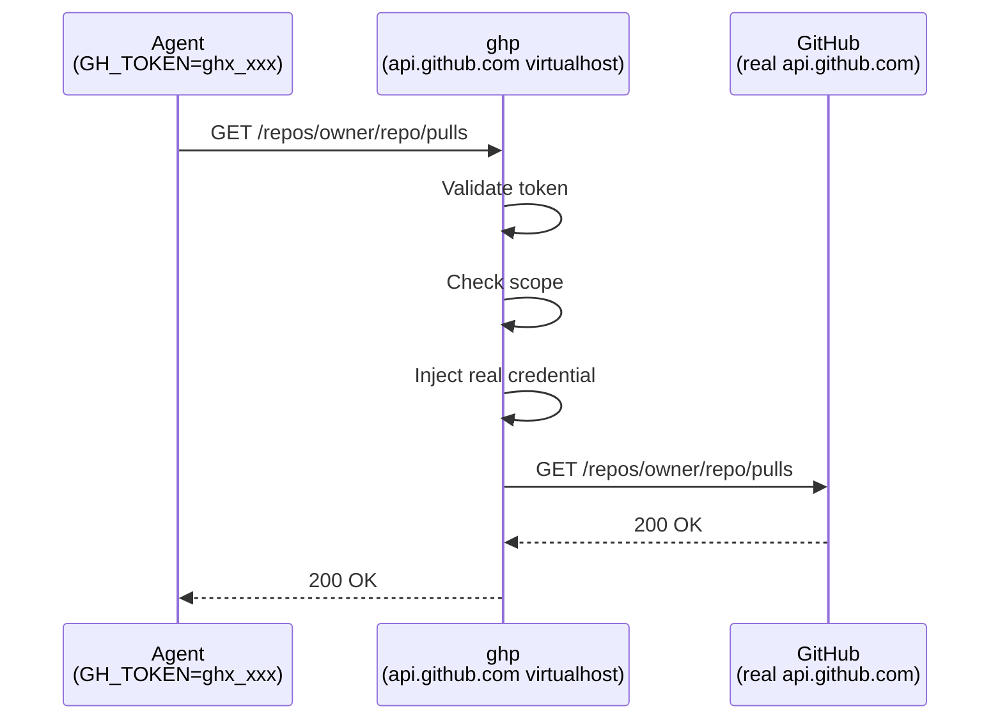

# How It Works

ghp acts as a transparent virtualhost for GitHub's API and web endpoints.
DNS (or `/etc/hosts`) on your agent network points `api.github.com` and
`github.com` at the ghp server. Agents set `GH_TOKEN` to a `ghx_`-prefixed
token and make standard GitHub API calls.

## Request Flow



For each request, the proxy:

1. Validates the `ghx_` token and checks it hasn't expired or been revoked
2. Verifies the request targets the allowed repository and permission scope
3. Injects the real GitHub credentials (stored server-side, encrypted at rest)
4. Forwards the request to the real GitHub endpoint and returns the response

## Virtualhost Routing

ghp routes traffic by `Host` header across four virtualhosts:

| Host | Handler |
|------|---------|
| `api.github.com` | API proxy — scope enforcement, credential injection, audit logging |
| `github.com` | Transparent passthrough — git clone/push with `ghx_`/`gha_` token interception |
| `*.githubcopilot.com` | Transparent passthrough for Copilot traffic — audit logging and metrics captured, no scope enforcement |
| Configured management host | Web UI, OAuth, token management API |

When the server terminates TLS directly (production mode), SNI selects the
correct certificate for each virtualhost. In legacy plain-HTTP mode (behind
a reverse proxy), the `Host` header alone drives routing.

## Security Model

- **Token isolation** — agents never see real GitHub credentials
- **Scope enforcement** — each token is locked to a single repository and specific permission scopes
- **Encryption at rest** — GitHub tokens are encrypted with AES-256-GCM before storage
- **Audit trail** — every proxied request is logged with token, repository, method, path, and status
- **Expiration** — tokens have a configurable lifetime (default 24h, max 7 days)
- **Revocation** — tokens can be revoked immediately via CLI or web UI

### Blocking Anonymous Git Traffic

When `block.anonymous_git` is enabled, ghp short-circuits anonymous git smart
HTTP requests — returning `401 Unauthorized` immediately instead of forwarding
them to GitHub. This prevents unauthenticated `git clone`, `git fetch`, and
`git ls-remote` operations from consuming upstream bandwidth or leaking
repository metadata through the proxy.

A request is classified as anonymous git traffic when **both** conditions are
true:

1. No `Authorization` header is present (or it is empty/unparseable)
2. A `Git-Protocol` header is present (e.g. `Git-Protocol: version=2`)

```yaml
block:
  anonymous_git: true
```

Blocked requests are counted by the `ghp_block_anonymous_git_total` Prometheus
counter, and the feature's on/off state is exported as the
`ghp_block_anonymous_git_enabled` gauge. The setting is hot-reloadable via
`SIGUSR1` without restarting the server.

!!! note "Detection relies on Git protocol version 2"
    Git ≥ 2.26 (released March 2020) defaults to protocol v2 and sends a
    `Git-Protocol: version=2` header on the initial smart HTTP request. Older
    clients using protocol v0 or v1 do **not** send this header, so their
    anonymous requests will pass through to GitHub unblocked. This is the right
    trade-off for an opt-in feature — it avoids false positives from non-git
    HTTP traffic that also lacks an `Authorization` header. If broader coverage
    is needed in future, a path-pattern heuristic (e.g. matching
    `/info/refs?service=git-upload-pack`) could supplement the header check.

### Release Download Controls

GitHub release assets (pre-built binaries, installers, archives) are fetched
via simple HTTPS GETs against `github.com` — outside the API scope model that
ghp enforces on other traffic. The release controls feature intercepts
requests matching `/{owner}/{repo}/releases/download/**` and applies a
configurable policy before they reach GitHub.

Two modes are available: **block** returns `403 Forbidden` immediately, and
**redirect** issues a `302` to an alternative download server (e.g. an
internal mirror of approved assets). Both modes support an allow list of
organisations or specific repositories that are exempt from the policy.

```yaml
releases:
  mode: block
  allow:
    - "myorg"
```

See [Release Download Controls](release-controls.md) for a detailed write-up
of the feature, configuration options, and trade-offs.

### Copilot Passthrough

Traffic to `*.githubcopilot.com` is forwarded transparently without token interception or
scope enforcement. This is by design — Copilot clients manage their own credentials. However,
every Copilot request is **audit-logged** (method, host, path, status, duration) and
**counted in Prometheus metrics** (`ghp_http_request_total{backend="copilot"}`) so that
Copilot activity remains observable alongside all other ghp traffic.
