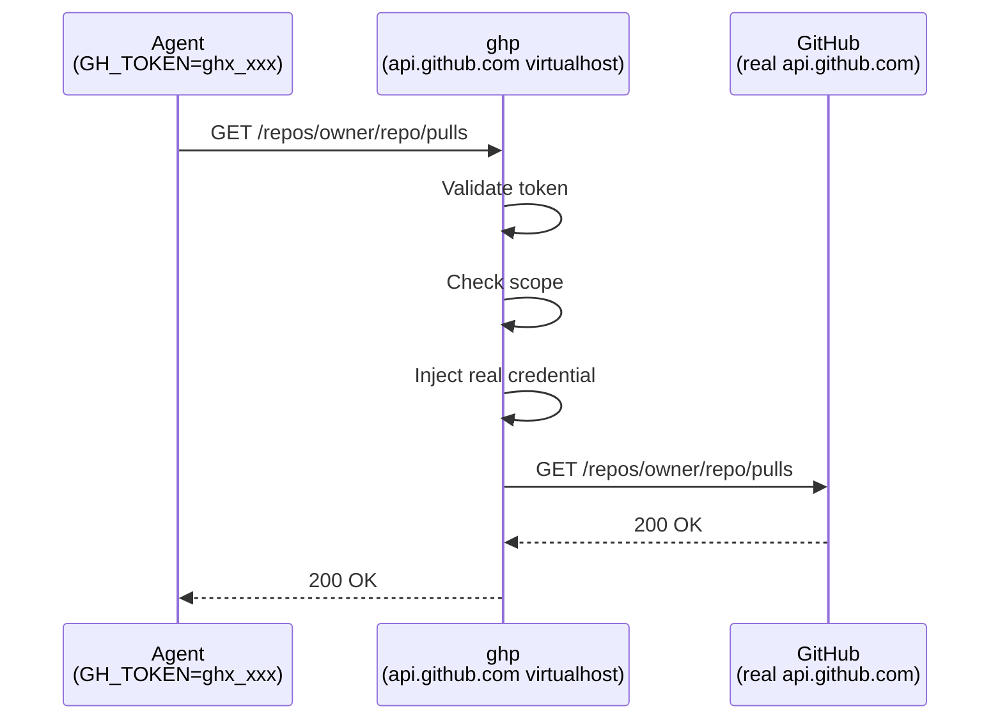

# How It Works

ghp acts as a transparent proxy for GitHub's API and web endpoints. Your
administrator configures DNS so that `api.github.com` and `github.com` resolve
to the ghp server on your network. Agents set `GH_TOKEN` to a ghp-issued token
and make standard GitHub API calls — no code changes or special SDKs required.

## Request Flow



For each request, the proxy:

1. Validates the token and checks it hasn't expired or been revoked
2. Verifies the request targets an allowed repository and permitted operation
3. Swaps in the real GitHub credentials (stored server-side, encrypted at rest)
4. Forwards the request to GitHub and returns the response unchanged

## Virtualhost Routing

ghp serves four distinct roles depending on which hostname the request arrives on:

| Hostname | Role |
|----------|------|
| `api.github.com` | **API proxy** — validates tokens, enforces scopes, injects credentials, logs every request |
| `github.com` | **Git passthrough** — transparent proxy for `git clone`, `git push`, etc. with token interception |
| `*.githubcopilot.com` | **Copilot passthrough** — forwards Copilot traffic transparently; all requests are logged |
| Your management host | **Dashboard** — web UI, GitHub OAuth login, token management API |

In TLS mode (recommended for production), ghp terminates TLS directly and uses
SNI to select the correct certificate for each hostname. In plain HTTP mode
(for development or behind a reverse proxy), routing is based on the `Host`
header alone.

## Security Model

- **Token isolation** — agents never see real GitHub credentials; they only hold short-lived ghp tokens
- **Scope enforcement** — tokens can be restricted to specific repositories and permission levels
- **Encryption at rest** — all stored GitHub credentials are encrypted with AES-256-GCM
- **Audit trail** — all requests produce structured JSON access logs (method, path, status, duration). API proxy requests additionally produce structured JSON audit log entries (`"logger":"audit"`) that include token, user, session, repository details, and request context. Token lifecycle events (creation, revocation) also emit audit log entries but may omit repository and request-related fields. Audit logs are written to the same output stream as access logs. Capturing and indexing these logs is the responsibility of the deployment environment (e.g. Splunk, Elastic, Datadog)
- **Expiration** — tokens have a configurable lifetime (default 24 hours, up to a server-configured maximum; default maximum 7 days)
- **Revocation** — tokens can be revoked immediately from the CLI or web dashboard
- **Border policy** — administrators can block specific GitHub token types from passing through the proxy (see [Token Type Border Policy](features/border-policy.md))

## Feature Summary

### Token Scoping

Tokens can be scoped to specific repositories and permission levels, ensuring
agents only access what they need. Open-scoped tokens (no restrictions) are
also supported when full access is appropriate.

See [Token Scoping](features/token-scoping.md) for details.

### Blocking Anonymous Git Traffic

Administrators can block unauthenticated git operations (clone, fetch,
ls-remote) from passing through the proxy. When enabled, requests without
credentials are rejected immediately rather than being forwarded to GitHub.

```yaml
block:
  anonymous_git: true
```

This setting can be changed without restarting the server (see
[Configuration](admin/configuration.md#hot-reloading)).

!!! note "Requires Git protocol version 2"
    Anonymous git blocking relies on the `Git-Protocol` header that Git 2.26+
    sends by default. Older Git clients that use protocol v0 or v1 are not
    detected and will pass through unblocked.

### Release Download Controls

GitHub release assets (binaries, installers, archives) are fetched via direct
HTTPS downloads, outside the scope model that ghp applies to API traffic. The
release controls feature lets administrators block or redirect these downloads.

See [Release Download Controls](features/release-controls.md) for configuration
and details.

### Copilot Passthrough

Traffic to `*.githubcopilot.com` is forwarded transparently. Copilot clients
manage their own credentials, so ghp does not intercept tokens or enforce
scopes on this traffic. All Copilot requests are still logged and counted
in metrics for full visibility.

### OAuth Broker

ghp can act as an OAuth broker for other services on your network, allowing
them to authenticate users via GitHub without needing their own OAuth
credentials.

See [OAuth Broker](features/oauth-broker.md) for integration details.
