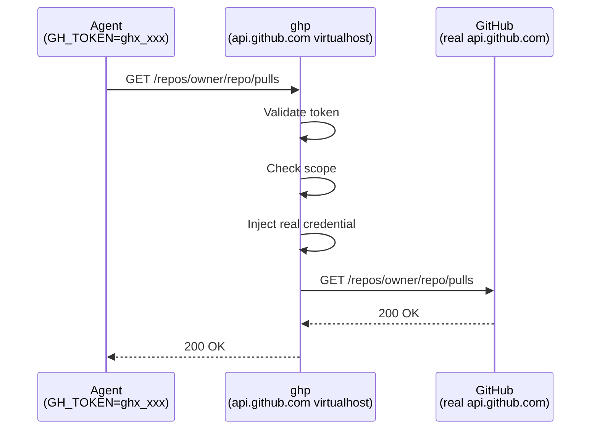

# How It Works

ghp acts as a transparent virtualhost for GitHub's API and web endpoints.
DNS (or `/etc/hosts`) on your agent network points `api.github.com` and
`github.com` at the ghp server. Agents set `GH_TOKEN` to a `ghx_`-prefixed
token and make standard GitHub API calls.

## Request Flow

For each request, the proxy:

1. Validates the `ghx_` token and checks it hasn't expired or been revoked
2. Verifies the request targets the allowed repository and permission scope
3. Injects the real GitHub credentials (stored server-side, encrypted at rest)
4. Forwards the request to the real GitHub endpoint and returns the response

## Virtualhost Routing

ghp routes traffic by `Host` header across four virtualhosts:

| Host | Handler |
|------|---------|
| `api.github.com` | API proxy — scope enforcement, credential injection, audit logging |
| `github.com` | Transparent passthrough — HTTPS git clone/push with `ghx_`/`gha_` token interception (SSH is **not** supported) |
| `*.githubcopilot.com` | Transparent passthrough for Copilot traffic — audit logging and metrics captured, no scope enforcement |
| Configured management host | Web UI, OAuth, token management API |

When the server terminates TLS directly (production mode), SNI selects the
correct certificate for each virtualhost. In legacy plain-HTTP mode (behind
a reverse proxy), the `Host` header alone drives routing.

## Security Model

- **Token isolation** — agents never see real GitHub credentials
- **Scope enforcement** — each token is locked to a single repository and specific permission scopes
- **Encryption at rest** — GitHub tokens are encrypted with AES-256-GCM before storage
- **Audit trail** — every proxied request is logged with token, repository, method, path, and status
- **Expiration** — tokens have a configurable lifetime (default 24h, max 7 days)
- **Revocation** — tokens can be revoked immediately via CLI or web UI

### HTTPS Only — No SSH Support

ghp intercepts GitHub credentials via HTTP `Authorization` headers, which means
it can only proxy HTTPS traffic. **Git's SSH protocol is not supported.** Because
the deployment model redirects `github.com` DNS to the proxy server, any agent
or user on the affected network that attempts to use SSH-based Git URLs
(`git@github.com:...`) will fail to connect. All Git operations must use HTTPS
URLs instead.

### Copilot Passthrough

Traffic to `*.githubcopilot.com` is forwarded transparently without token interception or
scope enforcement. This is by design — Copilot clients manage their own credentials. However,
every Copilot request is **audit-logged** (method, host, path, status, duration) and
**counted in Prometheus metrics** (`ghp_http_request_total{backend="copilot"}`) so that
Copilot activity remains observable alongside all other ghp traffic.
