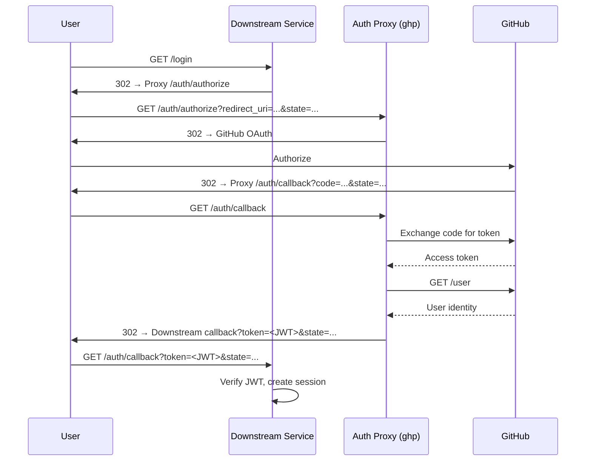

# OAuth Broker

The auth proxy can act as an **OAuth broker**, becoming the only component that
communicates with GitHub for authentication. Downstream services redirect users
to the proxy and trust the signed JWT responses they receive back.

This decouples downstream services from GitHub OAuth credentials entirely —
they never need a `client_id` or `client_secret`.

## How It Works



## Proxy Configuration

To enable the OAuth broker, add the following to your `ghp` configuration:

```yaml
auth:
  jwt_secret: "<shared-hmac-secret>"
  allowed_redirects:
    - "https://app.example.com/auth/callback"
    - "*.internal.example.com"
```

| Field | Description |
|-------|-------------|
| `auth.jwt_secret` | Shared HMAC-SHA256 secret used to sign broker JWTs. Must be shared with downstream services out-of-band. When set, the broker endpoints are enabled. |
| `auth.allowed_redirects` | List of permitted `redirect_uri` values. Supports exact URLs and wildcard domain patterns (e.g. `*.example.com`). |

Environment variable: `GHP_AUTH_JWT_SECRET`

!!! warning "Generate a strong secret"
    Use a cryptographically random secret of at least 32 bytes:

        openssl rand -hex 32

### GitHub App Setup

Register `{base_url}/auth/callback` as an additional **authorized callback URL**
in your GitHub App settings. This is required because the broker flow uses a
separate callback path from the management UI's `/auth/github/callback`.

---

## Integration Guide for Downstream Services

Downstream services do not need GitHub OAuth credentials. They delegate
authentication to the proxy and receive a signed JWT in return.

### Prerequisites

The downstream service needs two configuration values, provided by the proxy
operator:

| Value | Description | Example |
|-------|-------------|---------|
| `auth_proxy_url` | Base URL of the auth proxy | `https://auth-proxy.example.com` |
| `auth_jwt_secret` | Shared HMAC secret (HS256) used to verify token signatures | *(provided out-of-band)* |

### Starting the Login Flow

To initiate authentication, redirect the user to the proxy's authorize endpoint:

```
{auth_proxy_url}/auth/authorize?redirect_uri={callback_url}&state={csrf_token}
```

| Parameter | Description |
|-----------|-------------|
| `callback_url` | The downstream service's own callback endpoint. Must be registered on the proxy's `allowed_redirects` list. |
| `csrf_token` | An opaque value the downstream service generates and stores locally (e.g. in a session or cookie) for CSRF verification. |

**Example (Python / Flask):**

```python
import secrets
from urllib.parse import urlencode
from flask import redirect, session

@app.route("/login")
def login():
    state = secrets.token_urlsafe(32)
    session["oauth_state"] = state
    callback = "https://myapp.example.com/auth/callback"
    params = urlencode({"redirect_uri": callback, "state": state})
    return redirect(f"{AUTH_PROXY_URL}/auth/authorize?{params}")
```

### Handling the Callback

After the user authenticates with GitHub, the proxy redirects them back to
`callback_url` with two query parameters:

```
{callback_url}?token={jwt}&state={state}
```

The downstream service should:

1. **Verify `state`** matches the value stored at the start of the flow.
2. **Validate the JWT signature** using the shared HS256 secret.
3. **Check that `exp`** has not passed.
4. **Check that `aud`** matches the service's own callback URL.
5. **Create a local session** using the claims from the token.

**Example (Python / Flask):**

```python
import jwt  # PyJWT

@app.route("/auth/callback")
def auth_callback():
    # 1. Verify CSRF state
    if request.args.get("state") != session.pop("oauth_state", None):
        abort(403, "Invalid state")

    # 2-4. Validate JWT
    token = request.args["token"]
    try:
        claims = jwt.decode(
            token,
            AUTH_JWT_SECRET,
            algorithms=["HS256"],
            audience="https://myapp.example.com/auth/callback",
        )
    except jwt.InvalidTokenError as e:
        abort(401, f"Invalid token: {e}")

    # 5. Create local session
    session["user"] = claims["sub"]
    session["avatar_url"] = claims["avatar_url"]
    return redirect("/dashboard")
```

**Example (Go):**

```go
import "github.com/golang-jwt/jwt/v5"

type BrokerClaims struct {
    AvatarURL string `json:"avatar_url"`
    jwt.RegisteredClaims
}

func handleAuthCallback(w http.ResponseWriter, r *http.Request) {
    // 1. Verify CSRF state
    if r.URL.Query().Get("state") != getStoredState(r) {
        http.Error(w, "Invalid state", http.StatusForbidden)
        return
    }

    // 2-4. Validate JWT
    tokenStr := r.URL.Query().Get("token")
    token, err := jwt.ParseWithClaims(tokenStr, &BrokerClaims{},
        func(t *jwt.Token) (interface{}, error) {
            if _, ok := t.Method.(*jwt.SigningMethodHMAC); !ok {
                return nil, fmt.Errorf("unexpected signing method")
            }
            return []byte(authJWTSecret), nil
        },
        jwt.WithAudience("https://myapp.example.com/auth/callback"),
    )
    if err != nil {
        http.Error(w, "Invalid token", http.StatusUnauthorized)
        return
    }

    claims := token.Claims.(*BrokerClaims)

    // 5. Create local session
    createSession(w, r, claims.Subject, claims.AvatarURL)
    http.Redirect(w, r, "/dashboard", http.StatusSeeOther)
}
```

**Example (Node.js / Express):**

```javascript
const jwt = require("jsonwebtoken");

app.get("/auth/callback", (req, res) => {
  // 1. Verify CSRF state
  if (req.query.state !== req.session.oauthState) {
    return res.status(403).send("Invalid state");
  }
  delete req.session.oauthState;

  // 2-4. Validate JWT
  try {
    const claims = jwt.verify(req.query.token, AUTH_JWT_SECRET, {
      algorithms: ["HS256"],
      audience: "https://myapp.example.com/auth/callback",
    });

    // 5. Create local session
    req.session.user = claims.sub;
    req.session.avatarUrl = claims.avatar_url;
    res.redirect("/dashboard");
  } catch (err) {
    res.status(401).send("Invalid token");
  }
});
```

### JWT Claims

| Claim | Description |
|-------|-------------|
| `sub` | GitHub username (e.g. `octocat`) |
| `avatar_url` | GitHub avatar URL |
| `aud` | The `redirect_uri` this token was issued for |
| `iat` | Issued-at timestamp (Unix epoch) |
| `exp` | Expiry timestamp — 60 seconds after `iat` |

The token is **single-use and short-lived**. It exists only to bootstrap a local
session — downstream services should not store or reuse it beyond that.

No direct GitHub API calls are required on the downstream side.

---

## Trust Model

- The proxy and all downstream services share an **HMAC secret** (HS256).
- The proxy **signs**; downstream services **verify**.
- The JWT is **single-use and short-lived** (60 seconds) — it exists only to
  bootstrap the local session.

## Security Considerations

| Concern | Mitigation |
|---------|------------|
| Open redirect | `redirect_uri` must be validated against the `allowed_redirects` allowlist on the proxy side. This is the most critical control. |
| Token replay | The `aud` claim is set to the `redirect_uri`, so a JWT minted for one service cannot be replayed against another. |
| Token expiry | `exp` is set to 60 seconds. The JWT is consumed immediately on redirect and does not need to live longer. |
| CSRF | The `state` parameter round-trips through the entire flow, allowing the downstream service to verify it. |
| HTTP downgrade | The proxy rejects `redirect_uri` values that do not use HTTPS (except `localhost` in dev mode). |

## Proxy Endpoints

### `GET /auth/authorize`

Entry point for the OAuth flow. Downstream services redirect users here.

| Parameter | Description |
|-----------|-------------|
| `redirect_uri` | Where to send the user after auth. Must be on the allowlist. |
| `state` | Opaque value from the downstream service for CSRF protection. |

### `GET /auth/callback`

GitHub redirects here after the user authorizes. The proxy exchanges the code,
fetches the user's identity, mints a JWT, and redirects to the downstream
service's `redirect_uri` with `token` and `state` query parameters.
