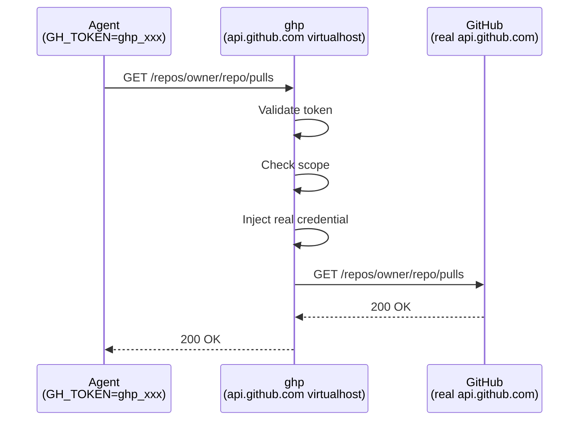

# Documentation Restructure Implementation Plan

> **For Claude:** REQUIRED SUB-SKILL: Use superpowers:executing-plans to implement this plan task-by-task.

**Goal:** Replace the monolithic README with a slim user-focused landing page, comprehensive mkdocs site, and auto-generated man pages.

**Architecture:** Three documentation tiers — README.md as a quick-start landing page for users, mkdocs-material site under `docs/` for admin/reference docs, and cobra/doc-generated man pages. Also fix the stale `GH_HOST` output in the CLI.

**Tech Stack:** mkdocs + mkdocs-material (Python/pip), github.com/spf13/cobra/doc (Go)

---

### Task 1: Fix GH_HOST output in CLI

The `ghp token create` command prints `export GH_HOST=...` which is no longer
needed — agents connect transparently via DNS and only need `GH_TOKEN`.

**Files:**
- Modify: `cmd/ghp/token.go:86-96`

**Step 1: Remove GH_HOST output**

In `cmd/ghp/token.go`, replace lines 85-96:

```go
			fmt.Printf("\nConfigure your agent:\n")
			fmt.Printf("  export GH_TOKEN=%s\n", result["token"])

			serverHost := cfg.ServerURL
			// Strip protocol.
			for _, prefix := range []string{"https://", "http://"} {
				if len(serverHost) > len(prefix) && serverHost[:len(prefix)] == prefix {
					serverHost = serverHost[len(prefix):]
					break
				}
			}
			fmt.Printf("  export GH_HOST=%s\n", serverHost)
```

with:

```go
			fmt.Printf("\nConfigure your agent:\n")
			fmt.Printf("  export GH_TOKEN=%s\n", result["token"])
```

**Step 2: Verify build**

Run: `go build ./cmd/ghp`
Expected: clean build

**Step 3: Commit**

```bash
git add cmd/ghp/token.go
git commit -m "fix: remove stale GH_HOST output from token create"
```

---

### Task 2: Slim down README.md

Replace the current README with a user-focused landing page. All admin/server
content moves to the mkdocs site in later tasks.

**Files:**
- Modify: `README.md`

**Step 1: Rewrite README.md**

Replace entire contents with:

```markdown
<p align="center">
  
</p>

# ghp

**GitHub Proxy for Autonomous Coding Agents**

Issue scoped, auditable tokens to coding agents. Agents interact with GitHub
through the proxy using opaque `ghp_`-prefixed tokens — they never see real
GitHub credentials.

- Agents use standard `gh` CLI, GitHub SDKs, or raw HTTP — no custom clients
- Repository and permission scopes enforced at the proxy
- Full audit trail of every proxied request
- Single static Go binary, self-hosted for your team

## Quick Start

Your administrator has already deployed ghp and configured DNS so that
`api.github.com` and `github.com` resolve to the proxy on your network.
You just need a token.

### Option A: Web UI

1. Open your team's ghp dashboard (e.g. `https://ghp.example.com`)
2. Sign in with GitHub
3. Click **Create Token**, choose a repository and scopes
4. Copy the `ghp_`-prefixed token

### Option B: CLI

```bash
ghp auth login
ghp token create --repo owner/repo --scope contents:read,pulls:write
```

### Give the token to your agent

```bash
export GH_TOKEN=ghp_...
```

The agent now uses GitHub through the proxy with scoped permissions. No other
configuration is needed — standard `gh` CLI, GitHub SDKs, and raw HTTP all
work transparently.

## Documentation

| Topic | Link |
|-------|------|
| How it works | [Architecture & virtualhost routing](docs/how-it-works.md) |
| Server setup | [Installation & deployment](docs/admin/deployment.md) |
| Configuration | [Full reference](docs/admin/configuration.md) |
| CLI reference | [All commands](docs/cli/index.md) |
| Web UI | [Dashboard & admin panel](docs/web-ui.md) |
| Development | [Contributing & dev mode](docs/development.md) |

> **Tip:** Run `mkdocs serve` from the repository root to browse the full
> documentation site locally.
```

**Step 2: Commit**

```bash
git add README.md
git commit -m "docs: slim README to user-focused landing page"
```

---

### Task 3: Set up mkdocs configuration

**Files:**
- Create: `mkdocs.yml`

**Step 1: Create mkdocs.yml**

```yaml
site_name: ghp
site_description: GitHub Proxy for Autonomous Coding Agents
repo_url: https://github.com/goodtune/ghp
repo_name: goodtune/ghp

theme:
  name: material
  palette:
    - media: "(prefers-color-scheme: light)"
      scheme: default
      toggle:
        icon: material/brightness-7
        name: Switch to dark mode
    - media: "(prefers-color-scheme: dark)"
      scheme: slate
      toggle:
        icon: material/brightness-4
        name: Switch to light mode
  features:
    - navigation.sections
    - navigation.expand
    - content.code.copy

markdown_extensions:
  - pymdownx.superfences:
      custom_fences:
        - name: mermaid
          class: mermaid
          format: !!python/name:pymdownx.superfences.fence_code_format
  - pymdownx.tabbed:
      alternate_style: true
  - admonitions
  - tables

nav:
  - Home: index.md
  - Getting Started: getting-started.md
  - How It Works: how-it-works.md
  - Administration:
    - Installation: admin/installation.md
    - Configuration: admin/configuration.md
    - Deployment: admin/deployment.md
    - GitHub App Setup: admin/github-app.md
  - CLI Reference:
    - Overview: cli/index.md
    - ghp serve: cli/serve.md
    - ghp migrate: cli/migrate.md
    - ghp auth: cli/auth.md
    - ghp token: cli/token.md
  - Web UI: web-ui.md
  - Development: development.md
```

**Step 2: Commit**

```bash
git add mkdocs.yml
git commit -m "docs: add mkdocs configuration with material theme"
```

---

### Task 4: Create docs site index and getting-started pages

**Files:**
- Create: `docs/index.md`
- Create: `docs/getting-started.md`

**Step 1: Create docs/index.md**

```markdown
# ghp

**GitHub Proxy for Autonomous Coding Agents**

ghp is a transparent reverse proxy that sits between your coding agents and
GitHub. Agents use standard GitHub tooling — they just set `GH_TOKEN` to a
scoped `ghp_`-prefixed token and everything works.

- **Scoped tokens** — each agent gets only the repository and permission access it needs
- **Audit trail** — every proxied request is logged
- **Transparent** — no custom clients, SDKs, or agent modifications required
- **Self-hosted** — single static Go binary for your team

## Next Steps

- [Getting Started](getting-started.md) — create your first token
- [How It Works](how-it-works.md) — architecture and virtualhost routing
- [Administration](admin/installation.md) — install and deploy ghp
- [CLI Reference](cli/index.md) — all commands
```

**Step 2: Create docs/getting-started.md**

```markdown
# Getting Started

This guide assumes your administrator has already deployed ghp and configured
DNS so that `api.github.com` and `github.com` resolve to the proxy on your
network. You just need a token.

## Create a Token

### Web UI

1. Open your team's ghp dashboard (e.g. `https://ghp.example.com`)
2. Sign in with GitHub
3. Click **Create Token**
4. Select the target repository
5. Choose permission scopes (e.g. `contents:read`, `pulls:write`)
6. Set a duration (default: 24 hours)
7. Click **Create** and copy the `ghp_`-prefixed token

### CLI

First, authenticate with the ghp server:

    ghp auth login

Then create a scoped token:

    ghp token create \
      --repo owner/repo \
      --scope contents:read,pulls:write \
      --duration 48h \
      --session "my-coding-session"

## Configure Your Agent

Set the token as `GH_TOKEN` in the agent's environment:

    export GH_TOKEN=ghp_xxxxxxxxxxxxxxxx

That's it. The agent now uses GitHub through the proxy with scoped permissions.
Standard `gh` CLI, GitHub SDKs, and raw HTTP all work transparently.

## Manage Tokens

List your active tokens:

    ghp token list

Revoke a token:

    ghp token revoke <token-id>

Or use the web dashboard to view and revoke tokens.

## Scopes

Scopes follow the GitHub API permission model. Common scopes:

| Scope | Description |
|-------|-------------|
| `contents:read` | Read repository contents (files, commits) |
| `contents:write` | Push commits, create/update files |
| `pulls:read` | Read pull requests |
| `pulls:write` | Create and update pull requests |
| `issues:read` | Read issues |
| `issues:write` | Create and update issues |
| `metadata:read` | Read repository metadata (always included) |
```

**Step 3: Commit**

```bash
git add docs/index.md docs/getting-started.md
git commit -m "docs: add index and getting-started pages"
```

---

### Task 5: Create how-it-works page

**Files:**
- Create: `docs/how-it-works.md`

**Step 1: Create docs/how-it-works.md**

This page contains the architecture description and diagrams that were
previously in README.md.

```markdown
# How It Works

ghp acts as a transparent virtualhost for GitHub's API and web endpoints.
DNS (or `/etc/hosts`) on your agent network points `api.github.com` and
`github.com` at the ghp server. Agents set `GH_TOKEN` to a `ghp_`-prefixed
token and make standard GitHub API calls.

## Request Flow



For each request, the proxy:

1. Validates the `ghp_` token and checks it hasn't expired or been revoked
2. Verifies the request targets the allowed repository and permission scope
3. Injects the real GitHub credentials (stored server-side, encrypted at rest)
4. Forwards the request to the real GitHub endpoint and returns the response

## Virtualhost Routing

ghp routes traffic by `Host` header across four virtualhosts:

| Host | Handler |
|------|---------|
| `api.github.com` | API proxy — scope enforcement, credential injection, audit logging |
| `github.com` | Transparent passthrough — git clone/push with `ghp_` token interception |
| `*.githubcopilot.com` | Transparent passthrough for Copilot traffic |
| Configured management host | Web UI, OAuth, token management API |

When the server terminates TLS directly (production mode), SNI selects the
correct certificate for each virtualhost. In legacy plain-HTTP mode (behind
a reverse proxy), the `Host` header alone drives routing.

## Security Model

- **Token isolation** — agents never see real GitHub credentials
- **Scope enforcement** — each token is locked to a single repository and specific permission scopes
- **Encryption at rest** — GitHub tokens are encrypted with AES-256-GCM before storage
- **Audit trail** — every proxied request is logged with token, repository, method, path, and status
- **Expiration** — tokens have a configurable lifetime (default 24h, max 7 days)
- **Revocation** — tokens can be revoked immediately via CLI or web UI
```

**Step 2: Commit**

```bash
git add docs/how-it-works.md
git commit -m "docs: add how-it-works architecture page"
```

---

### Task 6: Create admin documentation

**Files:**
- Create: `docs/admin/installation.md`
- Create: `docs/admin/github-app.md`
- Create: `docs/admin/configuration.md`
- Create: `docs/admin/deployment.md`

**Step 1: Create docs/admin/installation.md**

```markdown
# Installation

## Requirements

- Go 1.24+ (build from source)
- PostgreSQL 14+ (production) or SQLite (development)

## Build from Source

    git clone https://github.com/goodtune/ghp.git
    cd ghp
    make build

This produces a statically linked `ghp` binary (`CGO_ENABLED=0`).

## Verify

    ./ghp version
```

**Step 2: Create docs/admin/github-app.md**

```markdown
# GitHub App Setup

ghp authenticates users via GitHub OAuth and uses a GitHub App for API access.

## Create the App

1. Go to **Settings > Developer Settings > GitHub Apps > New GitHub App**
2. Set the **Homepage URL** to your ghp management host (e.g. `https://ghp.example.com`)
3. Set the **Callback URL** to `https://ghp.example.com/auth/github/callback`
4. Under **Permissions**, enable the permissions your agents will need
5. Enable **User-to-server tokens** under the OAuth section
6. Note the **Client ID** and generate a **Client Secret**

## Configure ghp

Add the credentials to your server configuration:

```yaml
github:
  client_id: "Iv1.abc123"
  client_secret: "your-client-secret"
```

Or via environment variables:

    export GHP_GITHUB_CLIENT_ID=Iv1.abc123
    export GHP_GITHUB_CLIENT_SECRET=your-client-secret

## Enterprise Restriction

If your organisation uses GitHub Enterprise Cloud, set the enterprise slug to
restrict API access to members of your enterprise:

```yaml
github:
  enterprise_slug: "my-enterprise"
```

This injects the `sec-GitHub-allowed-enterprise` header on all proxied API
requests.
```

**Step 3: Create docs/admin/configuration.md**

```markdown
# Configuration

Server configuration is loaded from a YAML file (via `--config` flag or
`GHP_CONFIG` env var). Environment variables override config file values using
the `GHP_` prefix.

## Environment Variables

| Variable | Description | Default |
|----------|-------------|---------|
| `GHP_ENCRYPTION_KEY` | AES-256-GCM key for encrypting GitHub tokens at rest | (required) |
| `GHP_DATABASE_DRIVER` | `sqlite` or `postgres` | `sqlite` |
| `GHP_DATABASE_DSN` | Database connection string | `ghp.db` |
| `GHP_SERVER_LISTEN` | Listen address for legacy plain HTTP mode | `:8080` |
| `GHP_SERVER_HTTPS_LISTEN` | HTTPS listen address (enables TLS mode) | |
| `GHP_SERVER_HTTP_LISTEN` | HTTP listen address for HTTPS redirects | |
| `GHP_SERVER_MANAGEMENT_HOST` | Hostname for management UI/API | |
| `GHP_SERVER_BASE_URL` | Base URL for OAuth callbacks and links | |
| `GHP_GITHUB_CLIENT_ID` | GitHub App client ID | |
| `GHP_GITHUB_CLIENT_SECRET` | GitHub App client secret | |
| `GHP_GITHUB_ENTERPRISE_SLUG` | Enterprise slug for access restriction header | |
| `GHP_TOKENS_DEFAULT_DURATION` | Default token lifetime | `24h` |
| `GHP_TOKENS_MAX_DURATION` | Maximum token lifetime | `168h` |
| `GHP_METRICS_ENABLED` | Enable Prometheus `/metrics` endpoint | `false` |
| ~~`GHP_METRICS_LISTEN`~~ | ~~Metrics listener address~~ (removed — `/metrics` is now served on the management mux) | |
| `GHP_DEV_MODE` | Enable test endpoints (never use in production) | `false` |

## Full YAML Reference

```yaml
github:
  client_id: ""
  client_secret: ""
  enterprise_slug: ""

database:
  driver: "sqlite"
  dsn: "ghp.db"

server:
  listen: ":8080"              # legacy plain HTTP mode
  https_listen: ":443"         # TLS mode (overrides listen)
  http_listen: ":80"           # HTTP-to-HTTPS redirect
  management_host: ""          # management UI hostname
  base_url: ""                 # e.g. https://ghp.example.com

tls:
  certificates:
    - cert_file: "/path/to/cert.pem"
      key_file: "/path/to/key.pem"

tokens:
  default_duration: "24h"
  max_duration: "168h"

logging:
  output: "stdout"             # "stdout" or "file"
  level: "info"                # "debug", "info", "warn", "error"
  file:
    path: "/var/log/ghp/ghp.log"

metrics:
  enabled: false
  # listen field removed — /metrics is served on the management mux

admins:
  - "alice"
  - "bob"
```

## Encryption Key

Generate an encryption key:

    export GHP_ENCRYPTION_KEY=$(openssl rand -hex 32)

This key encrypts GitHub tokens at rest. Store it securely — if lost, stored
tokens cannot be decrypted. Do not put it in the config file; use an
environment variable or secrets manager.
```

**Step 4: Create docs/admin/deployment.md**

```markdown
# Deployment

## TLS Termination (Recommended)

ghp terminates TLS directly and uses SNI to select the right certificate for
each virtualhost. This is the recommended production mode.

### TLS Certificates

You need certificates covering:

- `api.github.com` and `github.com`
- `*.githubcopilot.com`
- Your management host (e.g. `ghp.example.com`)

These can be separate certificates or combined using SANs. Configure them in
`server.yaml`:

```yaml
tls:
  certificates:
    - cert_file: "/etc/ghp/tls/github.pem"
      key_file: "/etc/ghp/tls/github-key.pem"
    - cert_file: "/etc/ghp/tls/copilot.pem"
      key_file: "/etc/ghp/tls/copilot-key.pem"
    - cert_file: "/etc/ghp/tls/mgmt.pem"
      key_file: "/etc/ghp/tls/mgmt-key.pem"
```

### DNS

Point the GitHub hostnames at your ghp server on the network(s) where your
agents run. This can be done via split-horizon DNS, `/etc/hosts`, or a local
DNS resolver:

```
api.github.com      → <ghp-server-ip>
github.com          → <ghp-server-ip>
*.githubcopilot.com → <ghp-server-ip>
```

Agents then connect to ghp transparently — no client configuration beyond
`GH_TOKEN` is needed.

### Run Migrations

    ghp migrate --config /etc/ghp/server.yaml

### Systemd Unit

Create `/etc/systemd/system/ghp.service`:

```ini
[Unit]
Description=ghp — GitHub Proxy for Coding Agents
After=network.target postgresql.service

[Service]
Type=notify
ExecStart=/usr/local/bin/ghp serve --config /etc/ghp/server.yaml
User=ghp
Group=ghp
Restart=on-failure
WatchdogSec=30

Environment=GHP_ENCRYPTION_KEY=<your-key>

AmbientCapabilities=CAP_NET_BIND_SERVICE
NoNewPrivileges=yes
ProtectSystem=strict
ProtectHome=yes
ReadWritePaths=/var/lib/ghp /var/log/ghp
PrivateTmp=yes

[Install]
WantedBy=multi-user.target
```

Start the service:

    systemctl daemon-reload
    systemctl enable --now ghp.service

Verify:

    curl -s https://ghp.example.com/auth/status

## Reverse Proxy Mode (Alternative)

If you prefer to run ghp behind a reverse proxy (e.g. Caddy, nginx) instead of
having it terminate TLS directly, omit the `https_listen`, `http_listen`, and
`tls` settings and use the legacy `listen` option:

```yaml
server:
  listen: "unix:///run/ghp/ghp.sock"
  base_url: "https://ghp.example.com"
```

Then configure your reverse proxy to forward traffic to the socket. The reverse
proxy handles TLS and routes the relevant Host headers to ghp.
```

**Step 5: Commit**

```bash
git add docs/admin/installation.md docs/admin/github-app.md docs/admin/configuration.md docs/admin/deployment.md
git commit -m "docs: add admin documentation (install, config, deploy, github app)"
```

---

### Task 7: Create CLI reference pages

**Files:**
- Create: `docs/cli/index.md`
- Create: `docs/cli/serve.md`
- Create: `docs/cli/migrate.md`
- Create: `docs/cli/auth.md`
- Create: `docs/cli/token.md`

**Step 1: Create docs/cli/index.md**

```markdown
# CLI Reference

ghp provides a command-line interface for server management and token
operations. Use `--help` on any command for full details.

    ghp --help

## Commands

| Command | Description |
|---------|-------------|
| [`ghp serve`](serve.md) | Run the server (proxy + web UI + API) |
| [`ghp migrate`](migrate.md) | Run database migrations |
| [`ghp auth`](auth.md) | Authenticate with the ghp server |
| [`ghp token`](token.md) | Create, list, and revoke proxy tokens |
| `ghp version` | Print version information |

## Global Flags

| Flag | Description |
|------|-------------|
| `--config` | Path to server configuration file (or set `GHP_CONFIG`) |

## Client Configuration

The CLI reads client settings from `~/.config/ghp/config.yaml`:

```yaml
server_url: "https://ghp.example.com"
user_token: "your-session-token"
```

These can also be set via environment variables:

| Variable | Description |
|----------|-------------|
| `GHP_SERVER_URL` | URL of the ghp management server |
| `GHP_USER_TOKEN` | Session token from `ghp auth login` |
```

**Step 2: Create docs/cli/serve.md**

```markdown
# ghp serve

Run the ghp server (proxy + web UI + API).

    ghp serve [--config path/to/config.yaml]

## Description

Starts the ghp server, which includes:

- GitHub API proxy with scope enforcement and credential injection
- Passthrough handlers for `github.com` and `*.githubcopilot.com`
- Management web UI and API
- Optional Prometheus metrics endpoint

The server runs until interrupted (SIGINT/SIGTERM).

## Modes

**TLS mode** (recommended for production): Set `server.https_listen` and
provide TLS certificates. Optionally set `server.http_listen` for HTTP-to-HTTPS
redirects.

**Plain HTTP mode** (development or behind reverse proxy): Set `server.listen`
only. No TLS certificates needed.

## Systemd Integration

The server supports systemd readiness notification (`Type=notify`) and watchdog.
See [Deployment](../admin/deployment.md) for a complete systemd unit file.

## Examples

Development:

    GHP_DEV_MODE=true GHP_DATABASE_DRIVER=sqlite GHP_DATABASE_DSN=ghp.db \
      GHP_ENCRYPTION_KEY=$(openssl rand -hex 32) \
      ghp serve

Production:

    ghp serve --config /etc/ghp/server.yaml
```

**Step 3: Create docs/cli/migrate.md**

```markdown
# ghp migrate

Run database migrations.

    ghp migrate [--config path/to/config.yaml]

## Description

Applies any pending database schema migrations. Run this before starting the
server for the first time and after upgrading to a new version.

## Subcommands

### ghp migrate status

Check migration status without applying changes:

    ghp migrate status

Outputs each migration and whether it has been applied.

## Examples

    ghp migrate --config /etc/ghp/server.yaml
    ghp migrate status
```

**Step 4: Create docs/cli/auth.md**

```markdown
# ghp auth

Authenticate with the ghp server.

## Subcommands

### ghp auth login

    ghp auth login

Authenticate via GitHub OAuth. Opens a browser to the ghp server's GitHub
OAuth flow. After authenticating, save the returned token:

    export GHP_USER_TOKEN=<token>

Or add it to `~/.config/ghp/config.yaml`.

### ghp auth status

    ghp auth status

Show current authentication status — displays your username and role if
authenticated.

## Configuration

Requires `GHP_SERVER_URL` to be set (or `server_url` in
`~/.config/ghp/config.yaml`).
```

**Step 5: Create docs/cli/token.md**

```markdown
# ghp token

Create, list, and revoke proxy tokens.

## Subcommands

### ghp token create

    ghp token create --repo owner/repo --scope contents:read,pulls:write [flags]

Create a new scoped `ghp_` token for an agent.

| Flag | Required | Default | Description |
|------|----------|---------|-------------|
| `--repo` | Yes | | Target repository (`owner/repo`) |
| `--scope` | Yes | | Comma-separated permissions (e.g. `contents:read,pulls:write`) |
| `--duration` | No | `24h` | Token lifetime (max: server-configured, default max 7 days) |
| `--session` | No | | Session identifier for audit tracking |

Example:

    ghp token create \
      --repo goodtune/myproject \
      --scope contents:read,pulls:write,issues:write \
      --duration 48h \
      --session "claude-code-feature-123"

### ghp token list

    ghp token list

List your active tokens with repository, scopes, session, expiry, and request
count.

### ghp token revoke

    ghp token revoke <token-id>

Revoke a token immediately. The token ID is shown by `ghp token list`.

## Authentication

All token commands require authentication. Set `GHP_SERVER_URL` and
`GHP_USER_TOKEN`, or run `ghp auth login` first.
```

**Step 6: Commit**

```bash
git add docs/cli/index.md docs/cli/serve.md docs/cli/migrate.md docs/cli/auth.md docs/cli/token.md
git commit -m "docs: add CLI reference pages"
```

---

### Task 8: Create web-ui and development pages

**Files:**
- Create: `docs/web-ui.md`
- Create: `docs/development.md`

**Step 1: Create docs/web-ui.md**

```markdown
# Web UI

ghp includes a built-in web dashboard for managing tokens and viewing audit
logs. Access it at the management host (e.g. `https://ghp.example.com`).

## Authentication

Users authenticate via GitHub OAuth. Click **Sign in with GitHub** to start the
OAuth flow.

In dev mode, the login page shows a test-login form that creates a session
directly — no GitHub OAuth required.

## Dashboard

After signing in, the dashboard shows:

- **Your Tokens** — active tokens with repository, scopes, expiry, and request count
- **Create Token** — form to create a new scoped `ghp_` token
- **Revoke** — revoke any of your tokens immediately

## Admin Panel

The `/admin` page is available to users with the `admin` role. Admins are
configured via the `admins` list in the server config file (GitHub usernames).

The admin panel provides:

- **Users** — list all registered users with their GitHub ID, role, and creation date
- **All Tokens** — view and revoke tokens across all users
- **Audit Log** — browse the full audit trail of proxied requests

In dev mode, navigating to `/admin` without a session shows a test-login form
that authenticates directly as an admin.
```

**Step 2: Create docs/development.md**

```markdown
# Development

## Requirements

- Go 1.24+
- Node.js (for E2E tests)

## Build

    make build

## Run Tests

Run unit tests and vet:

    make check

Run E2E tests (requires Node.js):

    cd e2e
    npm ci
    npx playwright install --with-deps chromium
    npx playwright test

## Dev Mode

Dev mode (`GHP_DEV_MODE=true`) enables:

- `/auth/test-login` endpoint — creates a test session without GitHub OAuth
- Built-in admin login form at `/admin` for quick access

### Quick Dev Setup

Generate an encryption key:

    export GHP_ENCRYPTION_KEY=$(openssl rand -hex 32)

Start the server:

    export GHP_DEV_MODE=true
    export GHP_DATABASE_DRIVER=sqlite
    export GHP_DATABASE_DSN=ghp.db
    export GHP_SERVER_LISTEN=:8080
    export GHP_GITHUB_CLIENT_ID=unused
    export GHP_GITHUB_CLIENT_SECRET=unused

    ./ghp migrate
    ./ghp serve

Create a test session:

    curl -s -X POST http://localhost:8080/auth/test-login \
      -H 'Content-Type: application/json' \
      -d '{"username": "dev", "role": "admin"}'

Save the `session_token` from the response, then create a scoped proxy token:

    curl -s -X POST http://localhost:8080/api/tokens \
      -H "Authorization: Bearer <session_token>" \
      -H 'Content-Type: application/json' \
      -d '{"repository": "owner/repo", "scopes": "contents:read,pulls:write", "duration": "1h"}'

## Project Layout

```
cmd/ghp/          CLI entrypoint and subcommands
internal/
  auth/           GitHub OAuth and session management
  config/         Configuration loading (YAML + env vars)
  crypto/         AES-256-GCM encryption for stored tokens
  database/       Database abstraction and migrations
  metrics/        Prometheus metrics
  proxy/          GitHub API proxy, passthrough handlers, token resolver
  server/         HTTP server, TLS, host dispatch, access logging
  token/          Token service (create, validate, revoke)
  web/            Web UI handlers and templates
```
```

**Step 3: Commit**

```bash
git add docs/web-ui.md docs/development.md
git commit -m "docs: add web-ui and development pages"
```

---

### Task 9: Add man page generation

Add a `ghp doc` hidden subcommand using `cobra/doc` and a `make man` target.

**Files:**
- Modify: `go.mod` (via `go get`)
- Create: `cmd/ghp/doc.go`
- Modify: `Makefile`

**Step 1: Add cobra/doc dependency**

Run: `cd /Users/gary/Projects/ghp && go get github.com/spf13/cobra/doc`

**Step 2: Create cmd/ghp/doc.go**

```go
package main

import (
	"fmt"
	"os"

	cobradoc "github.com/spf13/cobra/doc"
	"github.com/spf13/cobra"
)

func newDocCmd(rootCmd *cobra.Command) *cobra.Command {
	var outputDir string

	cmd := &cobra.Command{
		Use:    "doc",
		Short:  "Generate man pages",
		Hidden: true,
		RunE: func(cmd *cobra.Command, args []string) error {
			if err := os.MkdirAll(outputDir, 0755); err != nil {
				return fmt.Errorf("creating output directory: %w", err)
			}
			header := &cobradoc.GenManHeader{
				Title:   "GHP",
				Section: "1",
				Source:  "ghp " + version,
			}
			return cobradoc.GenManTree(rootCmd, header, outputDir)
		},
	}

	cmd.Flags().StringVarP(&outputDir, "output", "o", "doc/man1", "output directory for man pages")
	return cmd
}
```

Note: This requires modifying `cmd/ghp/main.go` to pass `rootCmd` to `newDocCmd`:

In `main.go`, change:
```go
	rootCmd.AddCommand(
		newServeCmd(),
		newMigrateCmd(),
		newAuthCmd(),
		newTokenCmd(),
		newVersionCmd(),
	)
```

to:

```go
	rootCmd.AddCommand(
		newServeCmd(),
		newMigrateCmd(),
		newAuthCmd(),
		newTokenCmd(),
		newVersionCmd(),
		newDocCmd(rootCmd),
	)
```

**Step 3: Add make man target**

Append to `Makefile`:

```makefile
## man: generate man pages
man: build
	./$(BINARY) doc --output doc/man1
```

**Step 4: Verify**

Run: `make man`
Expected: man pages generated in `doc/man1/`

Run: `man ./doc/man1/ghp.1`
Expected: displays the ghp man page

**Step 5: Commit**

```bash
git add cmd/ghp/doc.go cmd/ghp/main.go go.mod go.sum Makefile
git commit -m "feat: add man page generation via cobra/doc"
```

---

### Task 10: Verify everything builds and tests pass

**Step 1: Build**

Run: `make build`
Expected: clean build

**Step 2: Tests**

Run: `make check`
Expected: all tests pass, vet clean

**Step 3: Man pages**

Run: `make man`
Expected: man pages generated in `doc/man1/`

**Step 4: mkdocs (if pip available)**

Run: `pip install mkdocs-material && mkdocs build`
Expected: site built to `site/` directory (add `site/` to `.gitignore`)
